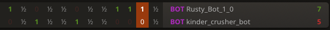
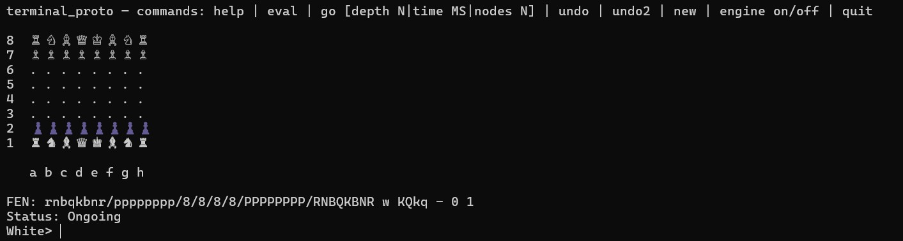
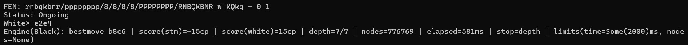
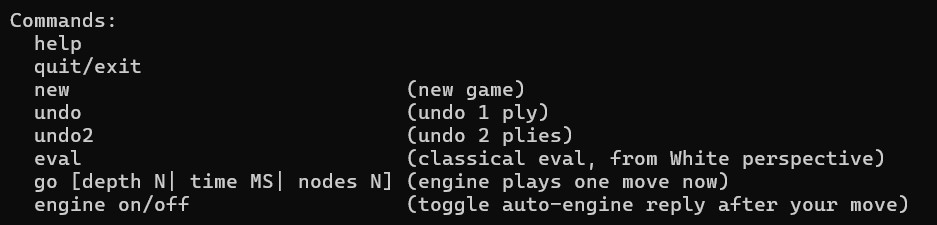
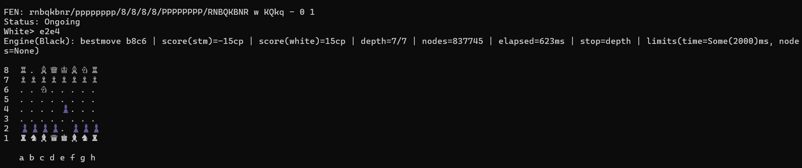
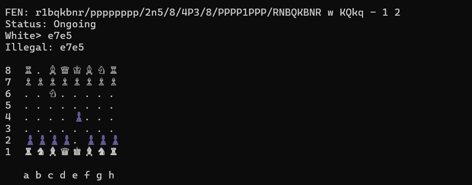
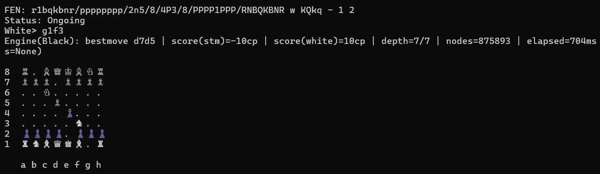
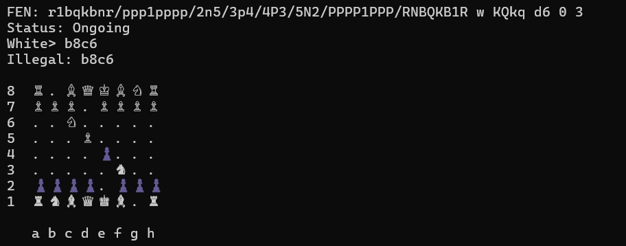
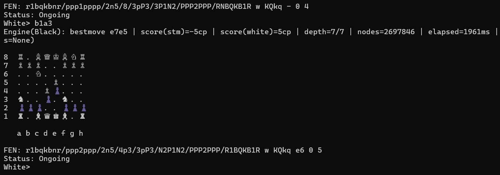

# Playing on Lichess
This section covers the engine connection via lichess. 
Here is an step-by-step instruction to connect with lichess.org:

- Create a new lichess account on lichess.org

- Create a new API Key (Preferences -> API access tokens)

- Change the lichess account to a Bot account. This is possible via terminal with

curl -X POST https://lichess.org/api/bot/account/upgrade -H "Authorization: Bearer lip_YOUR_TOKEN"

- Create a .env File on the same level as Cargo.toml. The .env needs to include the liches token, the path to the built engine
and the engine movetime in ms. e.g.:

LICHESS_TOKEN=lip_YOUR_TOKEN
ENGINE_PATH=./target/release/engine
MOVETIME_MS=2000

You can create the .env also via terminal with
cat > .env <<'EOF'
LICHESS_TOKEN=lip_YOUR_TOKEN
ENGINE_PATH=./target/release/engine
MOVETIME_MS=2000
EOF

- Now you can start the engine with 
cargo run --release --bin bot 
for classical eval mode
or with 
cargo run --release --features neural-eval --bin bot 
for neural eval mode.

If everything works proberly you should see in terminal
Starting Lichess Bot...
Configuration:
Engine path: ./target/release/engine
Move time: 2000ms
→ UCI: uci
← UCI: id name RustEngine 1.0
← UCI: id author Mario Orsolic, Emil Sitka, Julien Kriebel, Noah Schuller
← UCI: uciok
→ UCI: isready
← UCI: readyok
UCI Engine initialized
Logged in as: "YOUR_LICHESS_ACCOUNT_NAME"
Bot running, waiting for games...

- Now you can go to your created lichess account. With Play -> Challenge a friend you can callenge another lichess account for a match.

----------------------------------
# Classical vs Neural Eval
For testing we played a sequenz of games on lichess. One bot with classical, one with neural eval. The sample size is small,
but already the neural eval is ahead in a direct comparison. It was trained with millions of evaluated chess positions, so it is expected to have a better positional understand than the more simple classical eval, which is based mainly on piece values and slightly on piece positioning on the board.

# Estimated elo
Our engine was able to beat quit frequently the Stockfish engine on lichess with strength 6 out of 8, but loses always against strength 7 and 8. With a rough estimate our engine has a strength of 2000-2200 elo, which equals a strong club player.

----------------------------------
This section features the outlined MVP version of the project, where the user can play against our engine within the terminal
Both binaries apply the same game logic via the shared "terminal_common", however we use different position-evaluators.
The testing of the evaluators can be done as a comparison via lichess

Listed commands to run the default-run MVP (classical evaluator) in the terminal:
cargo run
cargo run --release

You can also run the classical evaluator binary with more explicit commands (if default-run changes):

# default (debug)
cargo run --bin terminal_proto_classical

# faster (release)
cargo run --release --bin terminal_proto_classical
Optionally use the explicit rust stable 1.85.8 version:
cargo +1.85.0 run --release --bin terminal_proto_classical

Listed commands to run the MVP (neural evaluator) in the termninal:

# default (debug)
cargo run --bin terminal_proto_neural --features nn

# faster (release)
cargo run --release --bin terminal_proto_neural --features nn

The following showcase will be using the release version of the classical evaluator:

# Using the terminal UI:

Layout:
When the program starts, you'll see a board and a prompt:
White> when it's White to move
Black> when it's Black to move
(The user starts as White as default)

You can enter commands: help, eval, go ...
You can enter moves in UCI (universal chess interface) format (eg e2e4, g1f3, promotions like e7e8q)

The chess board is always printed according to the change in the chess position.
Along with the board, you can see the FEN (Forsyth-Edwards Notation) including:
piece placement (Black lowercase, White uppercase), side to move,
catling rights, en-passant target square, halfmove clock, fullmove number
Also, the "Status" is printed which tells us the state of the game.
After a successful move, the next block is printed again (new FEN, prompt, board).

Also, a line is printed which includes desciptions about...

-Engine(Black): the engine searched and played a move for Black
-bestmove b8c6: the chosen move in UCI coordinates (from b8 to c6)
-score(stm)=-15cp: evaluation from side to move perspective
-score(white)=15cp: same evaluation, normalized to White's perspective 
(relevant during testing)
-depth=7/7: the engine completed search up to depth 7, with a depth limit of 7
(can be adjusted at any point in search module, like time and nodes)
-nodes=776769: How many search nodes were visited to pick the move
-elapsed=581ms: wall-clock time spent searching
-stop=depth: the search ended because it reached the depth limit
-limits(time=Some(2000)ms, nodes=None): a debug print of active search limits

Playing as Black:
The default setting is for the user to start as White, but you can
switch from White to BLack with the following sequence of commands:
"engine off-> go ... (engine move)-> engine on"-> your move as Black->
engine responds

# Command overview:

help: prints the list of available commands

undo: reverts the last half-move (one ply)
undo2: reverts the last 2 half-moves (a full move: your move + engine move)
The idea is to restore the previous position.

new: resets the board to the initial chess position

quit: exits the program

-Less relevant user commands, more relevant for debugging and comparisons of classical vs neural evaluation:

engine on/off: automatic engine replies
With "engine on" mode, after you play a move, the engnie will automatically respond with its own move, this is the normal cycle
in which we play against the engine. We move as White, the engine replies as Black. With "engine off", the engine will not move automatically.
In "engine off" mode, both moves will be expected to be user UCI moves, this way, it's also possible to play in the terminal with 2 users, one playing as White and the other as Black (in the stead of the engine)
You can also type "go ..." in this mode, which will make the engine
handle the move for the curret side-to-move.

go... : let's the engine search and play a move for the side to move
You can limit the search in 3 ways:

go depth N: search up to a fixed depth
example "go depth 6"

go time MS: search for a given time in milliseconds
example "go time 500"

go nodes N: search until a node budget is reached
example "go nodes 200000"

eval: prints evaluation score for the current position (typically positive means advantage for White)
we planned to use this for sanity checks (does the evaluation react to changes?) and it can be used to compare classical vs neural evaluator
on the same position

# Playing moves (UCI input):
Type a UCI move and enter, with default settings, the engine will respond with a move of its own and then,
it's the user's turn to type in a move again.

Possible seqence of moves:

White: e2e4, engine chooses bestmove

White: e7e5, determined as illegal move, nothing happens

White: g1f3, engine chooses bestmove

White: b8c6, determined as illegal move, nothing happens

White: d2d3, engine chooses bestmove

White: b1b3, engine chooses bestmove, White has to type in a move again

